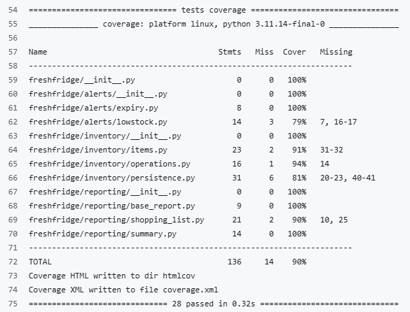

# FreshFridge 🧊 Package Function Documentation

A refrigerator inventory management system with expiry date alerts, low-stock detection, and shopping list generation.

[](https://badge.fury.io/py/freshfridge) [](https://github.com/ubco-mds-2025-labs/project-step-3-G14/actions)

**PyPI:** <https://pypi.org/project/freshfridge/>

## Features

-   Add, use, remove, and list items in your fridge
-   Track expiry dates and receive alerts for items expiring soon
-   Monitor low-stock items and set custom thresholds
-   Generate and export shopping lists
-   Persistent storage using JSON
-   Interactive command-line interface (CLI)
-   Comprehensive unit tests with \>75% coverage
-   Continuous integration via GitHub Actions
-   Exception handling in key methods (including custom `InvalidExpiryDateError`)

## Installation

Install from PyPI (recommended):

``` bash
pip install freshfridge
```

Or install from source (for development):

``` bash
git clone https://github.com/ubco-mds-2025-labs/project-step-3-G14.git
cd project-step-3-G14
pip install -e .
```

------------------------------------------------------------------------

# Usage

## Run the interactive CLI app

```{bash}
freshfridge
```

Available commands:

1.  `add` – Add a new item

2.  `use` – Use part of an item

3.  `show` – Show current inventory

4.  `exp` – Check expiring items

5.  `low` – Check low-stock items and manage thresholds

6.  `shop` – Generate shopping list

7.  `help` – Show all commands

8.  `quit` – Save and exit

------------------------------------------------------------------------

# Project Structure

``` text
freshfridge/
├── freshfridge/               # Core package
│   ├── inventory/             # Item management
│   │   ├── __init__.py
│   │   ├── items.py
│   │   ├── operations.py
│   │   └── persistence.py
│   ├── alerts/                # Expiry & low-stock alerts
│   │   ├── __init__.py
│   │   ├── expiry.py
│   │   └── lowstock.py
│   └── reporting/             # Summary & shopping list
│       ├── __init__.py
│       ├── base_report.py
│       ├── summary.py
│       └── shopping_list.py
├── scripts/
│   └── freshfridge_app.py     # Interactive CLI application
├── test/                      # Unit tests
│   ├── test_base_report.py
│   ├── test_expiry.py
│   ├── test_items.py
│   ├── test_lowstock.py
│   ├── test_operations.py
│   ├── test_shopping_list.py
│   ├── test_summary.py
│   └── test_suite.py
├── pyproject.toml
├── README.md
└── .github/workflows/ci.yml
```

The package is divided into three logical sub-packages:

-   **inventory** — manages items stored in the refrigerator\
-   **alerts** — checks expiry and low-stock warnings\
-   **reporting** — generates summaries and shopping lists

------------------------------------------------------------------------

# `inventory` Sub-Package

## `items.py`

This module defines the core data model used to represent a food item.

### **Class: `BaseItem`**

Parent class representing a general item.

| Method             | Description              |
|--------------------|--------------------------|
| `__init__(name)`   | Stores the item name.    |
| `rename(new_name)` | Updates the item’s name. |

------------------------------------------------------------------------

### **Class: `FreshItem(BaseItem)`**

Child class that inherits from `BaseItem`.\
Used for actual refrigerator items with quantity and expiry information.

| Method | Description |
|----|----|
| `__init__(name, quantity, unit, expiry_date)` | Initializes a fresh item with quantity, measurement unit, and expiry date. |
| `reduce_quantity(amount)` | Decreases the quantity, preventing values below zero. |
| `is_expiring_within(days)` | Returns `True` if the item expires within the next *X* days. |
| `is_expired()` | Returns `True` if the expiry date has passed. |

------------------------------------------------------------------------

## `operations.py`

Manages the refrigerator inventory through a dictionary of `FreshItem` objects.

### **Class: `InventoryOperations`**

| Method | Description |
|----|----|
| `__init__()` | Creates an empty inventory dictionary. |
| `add_item(name, quantity, unit, expiry_date)` | Adds or replaces an item in the inventory. |
| `use_item(name, quantity)` | Reduces the quantity of an item. |
| `remove_item(name)` | Deletes an item from the inventory. |
| `list_items()` | Returns a list of all `FreshItem` objects. |

------------------------------------------------------------------------

## `persistence.py`

Handles saving and loading the inventory from JSON.

### **Class: `InventoryPersistence`**

| Method | Description |
|----|----|
| `save_inventory(inventory, path)` | Writes the current inventory to a JSON file. |
| `load_inventory(inventory, path)` | Reads a JSON file and reconstructs all items using `add_item()`. |
| `inventory_to_dict(inventory)` | Converts the entire inventory to a dictionary for serialization. |

These functions ensure that the fridge state persists between program runs.

------------------------------------------------------------------------

# `alerts` Sub-Package

## `expiry.py`

Checks whether any items are close to expiring.

### **Class: `ExpiryAlerts`**

| Method | Description |
|----|----|
| `check_expiring(inventory, within_days)` | Returns items that expire within the given number of days. |
| `mark_expired(inventory)` | Returns a list of already expired items. |
| `days_until_expiry(item)` | Calculates how many days remain before an item expires. |

------------------------------------------------------------------------

## `lowstock.py`

Manages low-stock alerts based on user-defined thresholds.

### **Class: `LowStockAlerts`**

| Method | Description |
|----|----|
| `low_stock_alert(inventory, thresholds)` | Returns items whose quantity is below their threshold. |
| `update_thresholds(thresholds, new_thresholds)` | Updates the threshold dictionary. |
| `items_at_zero(inventory)` | Returns items with zero quantity remaining. |

------------------------------------------------------------------------

# `reporting` Sub-Package

## `base_report.py`

Parent class for other reporting modules.

### **Class: `BaseReport`**

| Method             | Description                                  |
|--------------------|----------------------------------------------|
| `count_items()`    | Returns number of items in the inventory.    |
| `list_all()`       | Returns a list of all items.                 |
| `get_item_names()` | Returns names of all items in the inventory. |

------------------------------------------------------------------------

## `summary.py`

Creates human-readable summaries of the fridge contents.

### **Class: `SummaryReport (BaseReport)`**

| Method | Description |
|----|----|
| `request_summary()` | Returns item information as a list of dictionaries. |
| `display_summary()` | Prints a formatted table-like overview. |
| `get_total_quantity()` | Sums quantities of all items. |

------------------------------------------------------------------------

## `shopping_list.py`

Creates and exports recommended shopping lists.

### **Class: `ShoppingListReport (BaseReport)`**

| Method | Description |
|----|----|
| `generate_shopping_list(thresholds)` | Calculates which items should be restocked. |
| `display_shopping_list(list)` | Prints a human-friendly shopping list. |
| `export_shopping_list(list, path)` | Saves the list to a text file. |

------------------------------------------------------------------------

# Testing & Coverage

All tests pass with \>75% coverage:

``` bash
pytest test/ --cov=freshfridge --cov-report=term-missing
```



Coverage report is automatically generated by GitHub Actions CI.

# Development

1.  Clone the repository

2.  Install in editable mode:

``` bash
pip install -e .
```

3.  Run tests:Bashpytest test/

4.  Run test suite:

``` bash
python test/test_suite.py
```

# License

MIT License

# Contributors

-   Yin-Wen Tsai
-   Jiaqi Yao
-   Sasivimol Sirijangkapattana
